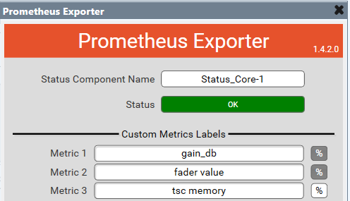

# Prometheus Exporter Plugin

This plugin provides metrics about the Qsys Core to a Prometheus scraper on HTTP port 10006.  HTTPS is not supported. 
You must have a Core Status component in the design with script access enabled.  This plugin should detect the name of that component automatically, and in the unlikely event you have more than one Status component you can select it by name.  The Status component should have verbose mode enabled or else some metrics will be unavailable.

Available metrics may vary depending on Core model.  This has been tested on Nano, 110f, and 510i.
Older versions of Qsys require _All_ access on the Status component, but _Script_ is sufficient on 9.8 and 9.9.

If you want to include packet counters for AES67 and Atmos receivers, enable script access for those components too. (tested only on 9.9)

Debug output logs the IP address of incoming requests if you are running version 9.8 or higher.

Up to 20 additional metrics can be included by setting the `Custom Metrics` property.  This will expose input pins which can be wired to any numeric value.  If you don't enter labels, they will be omitted.  For percent type values, toggle the '%' button on; for other number types, leave it off.

Plugin is based on the [BasicPluginFramework](https://bitbucket.org/qsc-communities/basicpluginframework/src/main/) from QSC and includes the VS Code submodule for easy compiling.

This plugin is not functional is emulation mode.
